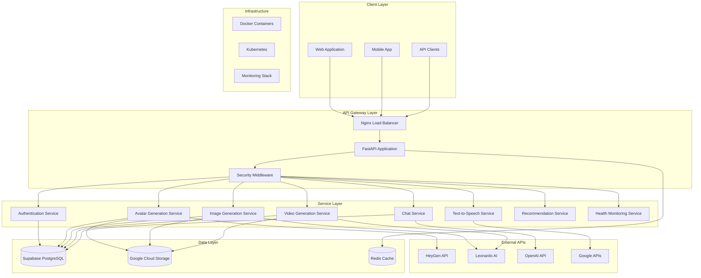
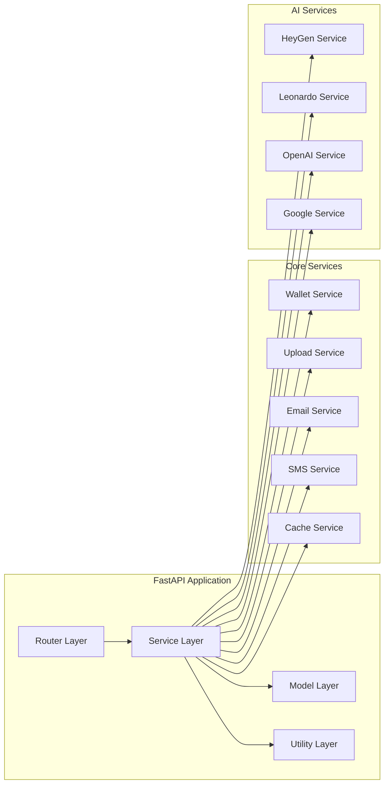
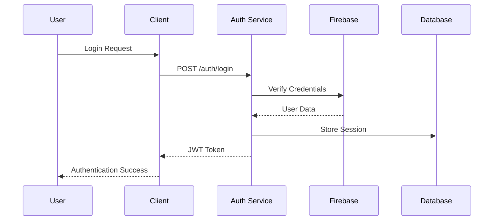
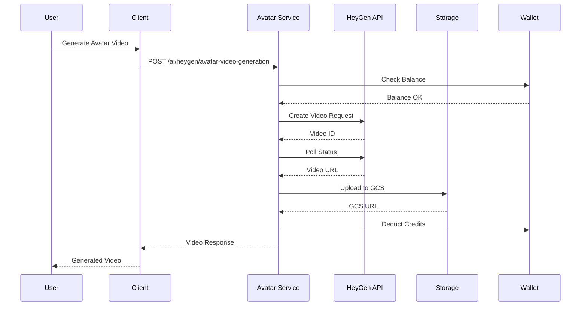
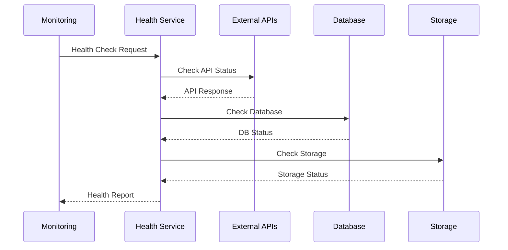

# KLIKYAI V3 - Architecture Design Document

## Table of Contents
1. [Overview](#overview)
2. [System Architecture](#system-architecture)
3. [Technology Stack](#technology-stack)
4. [Core Components](#core-components)
5. [Data Flow](#data-flow)
6. [Security Architecture](#security-architecture)
7. [Scalability & Performance](#scalability--performance)
8. [Deployment Architecture](#deployment-architecture)
9. [Monitoring & Observability](#monitoring--observability)
10. [API Design Patterns](#api-design-patterns)

## Overview

KLIKYAI V3 is a comprehensive AI-powered content generation platform that provides multiple AI services including image generation, video creation, avatar generation, text-to-speech, and chat functionality. The system is designed as a microservices architecture with a robust API gateway, authentication system, and scalable infrastructure.

### Key Features
- **AI Content Generation**: Image, video, avatar, and audio generation
- **Multi-Provider Support**: Integration with HeyGen, Leonardo AI, OpenAI, Google APIs
- **User Management**: Authentication, profiles, wallet system
- **Content Management**: Upload, storage, and retrieval of generated content
- **Real-time Features**: WebSocket support for live updates
- **Analytics & Monitoring**: Comprehensive health checks and system monitoring

## System Architecture

### High-Level Architecture



### Component Architecture



## Technology Stack

### Backend Technologies
- **Framework**: FastAPI (Python 3.9+)
- **Database**: Supabase (PostgreSQL)
- **Cache**: Redis
- **Storage**: Google Cloud Storage
- **Authentication**: Firebase Auth + Custom JWT
- **API Documentation**: OpenAPI/Swagger

### AI/ML Services
- **Avatar Generation**: HeyGen API
- **Image Generation**: Leonardo AI API
- **Video Generation**: Leonardo AI API
- **Text Generation**: OpenAI GPT API
- **Text-to-Speech**: Google Cloud TTS
- **Computer Vision**: Google Vision API

### Infrastructure
- **Containerization**: Docker
- **Orchestration**: Kubernetes
- **Load Balancer**: Nginx
- **Monitoring**: Sentry, Custom Health Checks
- **CI/CD**: GitHub Actions

### Frontend Technologies
- **Web Framework**: React.js / Next.js
- **Mobile**: React Native / Flutter
- **State Management**: Redux / Zustand
- **UI Components**: Material-UI / Ant Design

## Core Components

### 1. Authentication Service
- **Firebase Integration**: User authentication and management
- **JWT Tokens**: Secure API access
- **Role-based Access**: User permissions and roles
- **OTP System**: SMS/Email verification

### 2. Avatar Generation Service
- **HeyGen Integration**: Avatar video generation
- **Multiple Formats**: Support for different video formats
- **Face Swap**: Advanced face swapping capabilities
- **Voice Integration**: Text-to-speech with avatars

### 3. Image Generation Service
- **Leonardo AI**: High-quality image generation
- **Multiple Styles**: Cartoon, realistic, artistic styles
- **Batch Processing**: Multiple image generation
- **Upscaling**: Image enhancement and upscaling

### 4. Video Generation Service
- **Text-to-Video**: AI-powered video creation
- **Image-to-Video**: Video generation from images
- **Multiple Resolutions**: HD, 4K support
- **Style Transfer**: Different video styles

### 5. Chat Service
- **OpenAI Integration**: GPT-powered conversations
- **Context Management**: Conversation history
- **Streaming Support**: Real-time responses
- **Multi-language**: Support for multiple languages

### 6. Recommendation Service
- **Content-based Filtering**: AI-powered recommendations
- **User Behavior Analysis**: Personalized suggestions
- **Caching**: Redis-based caching for performance
- **Real-time Updates**: Live recommendation updates

### 7. Health Monitoring Service
- **Service Health Checks**: All external APIs
- **System Metrics**: Performance monitoring
- **Alerting**: Automated error notifications
- **Dashboard**: Real-time system status

## Data Flow

### 1. User Authentication Flow


### 2. Avatar Generation Flow


### 3. Health Check Flow


## Security Architecture

### 1. Authentication & Authorization
- **Multi-layer Security**: API keys, JWT tokens, Firebase auth
- **Rate Limiting**: Per-user and per-endpoint limits
- **IP Whitelisting**: Restricted access for admin endpoints
- **CORS Configuration**: Cross-origin request security

### 2. Data Security
- **Encryption**: All sensitive data encrypted at rest
- **Secure Communication**: HTTPS/TLS for all communications
- **API Key Management**: Secure storage and rotation
- **Input Validation**: Comprehensive request validation

### 3. Infrastructure Security
- **Container Security**: Docker security best practices
- **Network Security**: VPC and firewall configuration
- **Secrets Management**: Environment variable security
- **Audit Logging**: Comprehensive security logging

## Scalability & Performance

### 1. Horizontal Scaling
- **Microservices**: Independent service scaling
- **Load Balancing**: Nginx-based load distribution
- **Container Orchestration**: Kubernetes auto-scaling
- **Database Scaling**: Read replicas and connection pooling

### 2. Performance Optimization
- **Caching Strategy**: Redis for frequently accessed data
- **CDN Integration**: Global content delivery
- **Async Processing**: Non-blocking operations
- **Connection Pooling**: Database connection optimization

### 3. Resource Management
- **Memory Optimization**: Efficient data structures
- **CPU Optimization**: Async/await patterns
- **Storage Optimization**: Efficient file handling
- **Network Optimization**: Request batching and compression

## Deployment Architecture

### 1. Container Strategy
```yaml
# Docker Compose Structure
services:
  api:
    build: ./api
    ports:
      - "8000:8000"
    environment:
      - DATABASE_URL=${DATABASE_URL}
      - REDIS_URL=${REDIS_URL}
    depends_on:
      - redis
      - database
  
  redis:
    image: redis:alpine
    ports:
      - "6379:6379"
  
  nginx:
    image: nginx:alpine
    ports:
      - "80:80"
      - "443:443"
    volumes:
      - ./nginx.conf:/etc/nginx/nginx.conf
```

### 2. Kubernetes Deployment
```yaml
# Kubernetes Deployment
apiVersion: apps/v1
kind: Deployment
metadata:
  name: klikyai-api
spec:
  replicas: 3
  selector:
    matchLabels:
      app: klikyai-api
  template:
    metadata:
      labels:
        app: klikyai-api
    spec:
      containers:
      - name: api
        image: klikyai-api:latest
        ports:
        - containerPort: 8000
        env:
        - name: DATABASE_URL
          valueFrom:
            secretKeyRef:
              name: klikyai-secrets
              key: database-url
```

### 3. CI/CD Pipeline
```yaml
# GitHub Actions Workflow
name: Deploy to Production
on:
  push:
    branches: [main]
jobs:
  deploy:
    runs-on: ubuntu-latest
    steps:
    - uses: actions/checkout@v2
    - name: Build Docker Image
      run: docker build -t klikyai-api .
    - name: Deploy to Kubernetes
      run: kubectl apply -f k8s/
```

## Monitoring & Observability

### 1. Health Monitoring
- **Service Health Checks**: All external APIs monitored
- **System Metrics**: CPU, memory, disk usage
- **Application Metrics**: Request rates, response times
- **Error Tracking**: Sentry integration for error monitoring

### 2. Logging Strategy
- **Structured Logging**: JSON-formatted logs
- **Log Levels**: DEBUG, INFO, WARNING, ERROR, CRITICAL
- **Log Aggregation**: Centralized log collection
- **Log Retention**: Configurable retention policies

### 3. Alerting System
- **Threshold-based Alerts**: Performance degradation alerts
- **Error Rate Alerts**: High error rate notifications
- **Service Down Alerts**: External service failure alerts
- **Custom Alerts**: Business-specific alerting rules

## API Design Patterns

### 1. RESTful Design
- **Resource-based URLs**: Clear resource identification
- **HTTP Methods**: Proper use of GET, POST, PUT, DELETE
- **Status Codes**: Meaningful HTTP status codes
- **Content Negotiation**: JSON response format

### 2. Error Handling
- **Consistent Error Format**: Standardized error responses
- **Error Codes**: Unique error identifiers
- **Error Context**: Detailed error information
- **Error Recovery**: Graceful error handling

### 3. Response Format
```json
{
  "success": true,
  "message": "Operation completed successfully",
  "data": {
    // Response data
  },
  "meta": {
    "user_id": "user_123",
    "timestamp": "2024-01-15T10:30:00Z",
    "request_id": "req_456"
  }
}
```

### 4. Pagination
```json
{
  "success": true,
  "data": {
    "items": [...],
    "pagination": {
      "page": 1,
      "limit": 20,
      "total": 100,
      "pages": 5
    }
  }
}
```

## Conclusion

The KLIKYAI V3 architecture is designed for scalability, reliability, and performance. The microservices approach allows for independent scaling and deployment of components, while the comprehensive monitoring and health check system ensures system reliability. The security architecture provides multiple layers of protection, and the API design patterns ensure consistency and maintainability.

This architecture supports the platform's growth and can accommodate future enhancements and additional AI services as needed.
